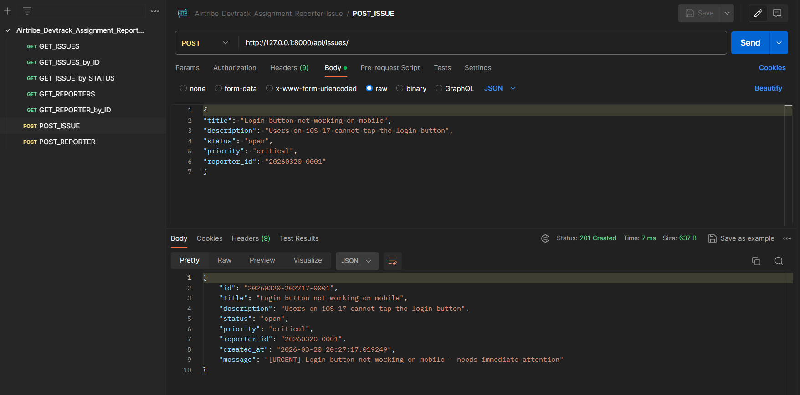
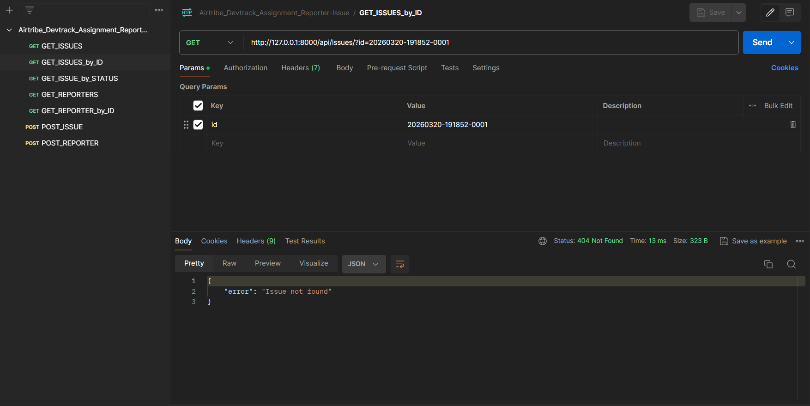
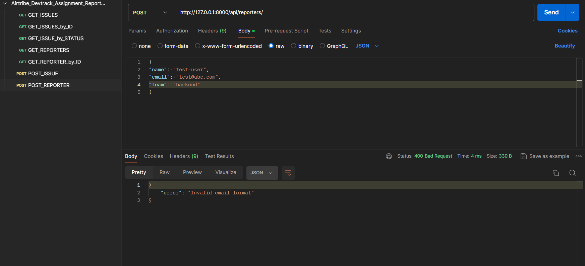

# DevTrack

A Django-based backend API for tracking engineering bugs using OOP principles and JSON file storage.

## Table of Contents
- [DevTrack](#devtrack)
	- [Table of Contents](#table-of-contents)
	- [How to Run](#how-to-run)
	- [Dashboard (Testing Tool)](#dashboard-testing-tool)
	- [Endpoints](#endpoints)
		- [Reporters](#reporters)
		- [Issues](#issues)
	- [Design Decision](#design-decision)
	- [Postman Testing \& Validation](#postman-testing--validation)

## How to Run
1. **Clone the repository.**
2. **Setup:** Ensure Python 3.12+ is installed.
3. **Install Dependencies:** Run `pip install -r requirements.txt` in the project directory.
4. **Run Server:** `python manage.py runserver` in your terminal.
5. **Access Dashboard:** Navigate to `http://127.0.0.1:8000/api/` to use the dashboard.

## Dashboard (Testing Tool)
n addition to raw API endpoints, this project includes a **built-in HTML/CSS Dashboard** to make manual testing easier:
- **Location:** Accessible at the root `/api/` path.
- **Features:**
    - **Register Reporters:** A dedicated form to create new team members.
    - **Dynamic Issue Reporting:** The issue form automatically populates a "Reporter" dropdown by fetching data from the API.
    - **Live Feed:** Displays a list of all current issues with color-coded priority badges.
    - **CSRF Integration:** Automatically handles security tokens for seamless `POST` requests.

## Endpoints
### Reporters
- `POST /api/reporters/`: Create a new reporter (Requires `name`, `email`, and `team` fields).
- `GET /api/reporters/`: List all reporters.
- `GET /api/reporters/?id=`: Find a specific reporter by ID.

### Issues
- `POST /api/issues/`: Create an issue (automatically instantiates `CriticalIssue` or `LowPriorityIssue` subclasses).
- `GET /api/issues/`: List all issues.
- `GET /api/issues/?id=`: Find a specific issue.
- `GET /api/issues/?status=`: Filter issues by status (`open`, `closed`, `in_progress`, `resolved`).
- `GET /api/issues/?priority=`: Filter issues by priority (`low`, `medium`, `high`, `critical`).

## Design Decision
**Decision:** Custom Timestamp-Based ID Generation (`YYYYMMDD-HHMMSS-0001` for issues & `YYYYMMDD-0001` for reporters).

**Why:** Since this project uses raw JSON files instead of a relational database with `AutoField`, generating unique IDs is a challenge. By combining the date, time, and a serial suffix, I ensured that:

1. IDs are globally unique even if multiple entries are created on the same day.
2. IDs are naturally sortable by time.
3. The system avoids "ID collisions" that happen with simple integer incrementing in shared file environments.

## Postman Testing & Validation
T
he following screenshots demonstrate the API's behavior for both successful operations and error handling.

1. **Success Case: Issue Creation (201 Created)**

    - **Endpoint:** `POST /api/issues/`
    - **Scenario:** Creating a new issue with "critical" priority.
    - **Validation:** Notice that the API automatically uses the `CriticalIssue` subclass, generating a unique ID and a specialized `message` starting with `[URGENT]`.
    - 

1. **Failure Case: Resource Not Found (404 Not Found)**
    - **Endpoint:** `GET /api/issues/?id=non-existent-id`
    - **Scenario:** Attempting to fetch a specific issue using an ID that does not exist in `issues.json`.
    - **Validation:** The server correctly identifies the missing resource and returns a `404 Not Found` status with a descriptive JSON error message.
    - 

1. **Failure Case: Validation Error (400 Bad Request)**
    - **Endpoint:** `POST /api/reporters/`
    - **Scenario:** Sending a payload with an invalid email format (missing `@`).
    - **Validation:** The `Reporter.validate()` method catches the error before saving to the file, returning a `400 Bad Request` to the client.
    - 